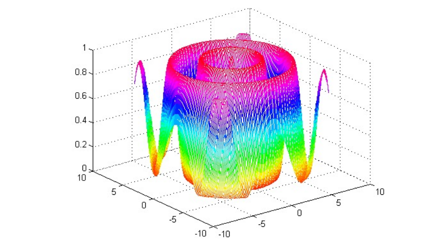
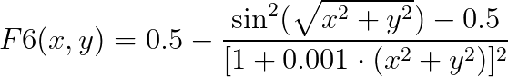
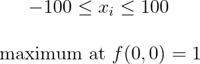
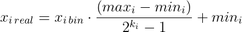
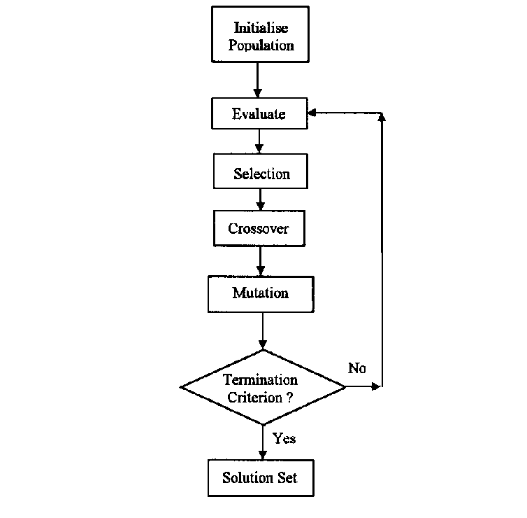
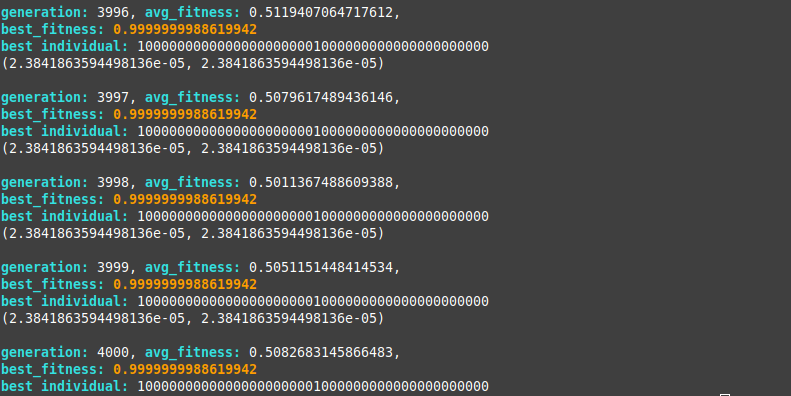

# Genetic-Algorithm
A practical application of Genetic Algorithms to optimize functions.


<p align="right">
    <i>Schaffer's F6</i>
</p>

## How-to

Consider the following function:

<p align="center">
    
</p>

<p align="center">
    
</p>

In this case, each chromosome will have a 44-bit word, with **k_i** = 22 bits to each variable of the problem. The function to convert this representation to a real number is:

<p align="center">
    
</p>

where:

<p align="center">
    
</p>

<p align="center">
    
</p>

With that, we define the parameters for the algorithm (F6 as the fitness function, a fixed mutation and crossover rates, a fixed population size), and follows these steps: 

<p align="center">
    
</p>

Where the termination criterion is a fixed number of generations.

## Running

```shell
$ git clone https://github.com/tonisidneimc/Genetic-Algorithm/
$ cd Genetic-Algorithm
$ make
```

### Output



It may vary due to randomness in the evolution process, but running the algorithm a few more times or with higher mutation rates or higher number of generations may converge better.
